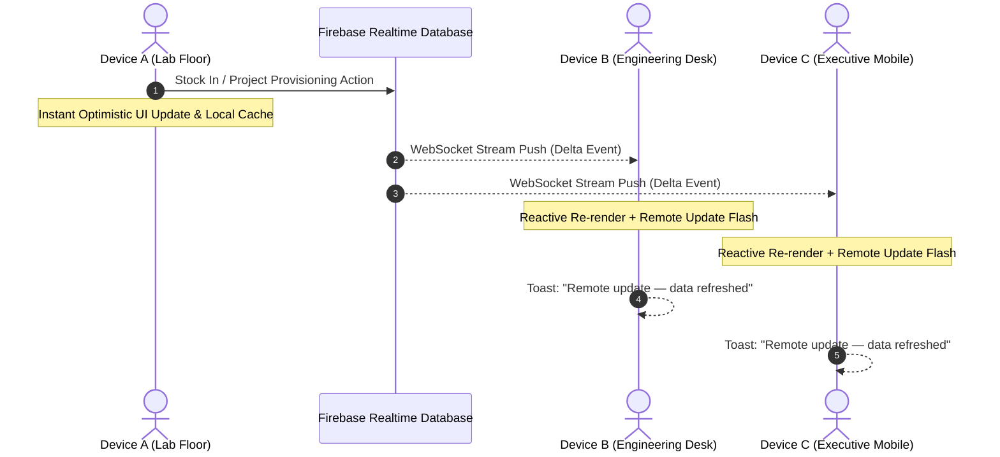

# Inven3 — Enterprise IoT Project & Inventory Management ERP

<div align="center">


<br/>
[](https://firebase.google.com/)
[](https://developer.mozilla.org/)
[](https://playwright.dev/)
[](#offline-first-resilience--automatic-synchronization)
[-d97706?style=flat-square)](#executive-analytics--kpi-dashboard)

**A high-performance, real-time, offline-resilient Enterprise Resource Planning (ERP) suite engineered for IoT laboratories, hardware engineering teams, and component supply chains.**

[Key Features](#-enterprise-feature-matrix) • [Real-Time Sync Engine](#-real-time-reflection-without-refreshing) • [Offline Resilience](#-offline-first-resilience--automatic-synchronization) • [System Architecture](#-system-architecture) • [Getting Started](#-getting-started) • [Quality Assurance](#-testing--quality-assurance)

</div>

---

## 🌟 Executive Overview

**Inven3** is purpose-built to solve the high-velocity hardware tracking challenges of embedded systems engineering and IoT development laboratories. Unlike monolithic inventory platforms burdened with heavy framework overhead, Inven3 operates on a **zero-framework, ultra-responsive reactive architecture** powered by bidirectional WebSocket data streams via Firebase Realtime Database.

Every stock transaction, component allocation, project bill-of-materials (BOM) assignment, and warehouse relocation is synchronized **instantly across all connected devices without page refreshes**, with complete offline autonomy and automatic reconciliation once connectivity resumes.

---

## ⚡ Real-Time Reflection (Without Refreshing)

Inven3 features a bidirectional real-time data bus that connects every user and workstation in the facility:



### Key Real-Time Capabilities:
- **Zero-Latency State Broadcasts**: When a technician on Device A performs a Stock In, Stock Out, or Project Assignment, all other workstations (Device B, C, N) update their views **immediately** without requiring manual browser reloads or polling.
- **Visual Synchronization Cues**: When a remote update is received from another station, the application triggers a gentle, non-disruptive visual glow across the interface and alerts the operator via a high-visibility toast notification.
- **Reactive DOM Engine**: Fine-grained DOM re-rendering guarantees that dashboard KPIs, stock health status pills, category totals, and interactive tables reflect the exact state across the entire physical plant simultaneously.

---

## 📴 Offline-First Resilience & Automatic Synchronization

Inven3 is designed to survive real-world field conditions, cleanroom shielding, and intermittent network outages:

```
┌─────────────────────────────────────────────────────────────────────────┐
│                      OFFLINE OPERATION CYCLE                            │
│                                                                         │
│   [ ONLINE ] ──────────► [ NETWORK DROPPED ] ──────────► [ RECONNECTED ]│
│        │                          │                             │       │
│   Full Real-Time             Local Cache               Auto-Reconcile   │
│   WebSocket Sync             Seamless Work             Pushes/Pulls Live│
│   Firebase RTDB              LocalStorage              Syncs State      │
└─────────────────────────────────────────────────────────────────────────┘
```

1. **Seamless Local Execution**: If network connectivity is lost, Inven3 automatically detects the offline state, updates the persistent status indicator to `🔴 Offline`, and seamlessly transitions to the local browser storage cache (`localStorage`).
2. **Zero Interruption in Workflow**: Operators can continue searching, inspecting components, assigning BOM items, and reviewing project specifications completely uninterrupted while disconnected.
3. **Automatic Live Recovery**: The instant internet connectivity is re-established:
   - The Firebase socket listener automatically reconnects.
   - The status indicator updates to `🟢 Live · [Timestamp]`.
   - The remote state is fetched, synchronized, and rendered with complete data consistency.
   - Write-block guards prevent stale offline payloads from accidentally overwriting concurrent remote changes.

---

## 🎯 Enterprise Feature Matrix

### 1. 📦 End-to-End Component Lifecycle Management
- **Full SKU Registry**: Comprehensive registry tracking SKU, component name, category, warehouse location, spare stock, in-use stock, total units, unit of measure, purchase cost, selling/book value, and vendor/supplier details.
- **Intelligent SKU Generator**: Built-in automated SKU synthesizer adhering to enterprise naming conventions (`SKU-[CATEGORY]-[NAME]-[RANDOM]`).
- **Duplicate SKU Collision Prevention**: Immediate validation blocks duplicate SKU insertions across all warehouse records.
- **Stock In & Stock Out Quick Actions**: Single-click `+ In` and `- Out` modal triggers directly accessible from every component row for lightning-fast lab throughput.
- **Multi-Warehouse Transfers**: Seamless transfer engine moving stock between locations (e.g., *Main Central Hub* ➔ *IoT Research Lab* ➔ *Field Assembly Workshop*) with full audit logging.

### 2. 🛡️ Mathematical Invariant Conservation & Data Integrity
- **Strict Conservation Law**: 
  $$\text{Total Quantity} \equiv \text{Spare Quantity} + \text{In-Use Quantity}$$
- **Zero-Stock & Negative Quantity Prevention**: The system strictly prevents spare stock from dropping below zero during assignments, stock-outs, or transfers.
- **Atomic Operations**: Hardware allocations decrement Spare stock and increment In-Use stock in a single atomic transaction.

### 3. 🚀 IoT Project Hardware BOM Provisioning
- **Project Directory**: Manage active, deployed, and completed IoT projects (e.g., *Smart Greenhouse Auto-Waterer*, *IoT Home Weather Hub*, *Autonomous Plant Rover*).
- **Direct BOM Allocation**: Assign hardware components directly from available spare stock into active prototypes with one click.
- **Safe Hardware De-Provisioning**: Returning parts from a project restores hardware directly back to Spare stock without data loss.
- **Direct Project Intake**: Register new components directly into a project BOM with automated dual-ledger recording.
- **Safe Project Deletion**: Deleting a project automatically de-provisions and returns all assigned hardware components back to the Spare warehouse inventory.

### 4. 📊 Executive Analytics & KPI Dashboard
- **Asset Valuation Counter**: Real-time monetary valuation of all on-hand hardware calculated in **Indian Rupees (₹)** (`₹ Asset Valuation` & `₹ Procurement Cost`).
- **Live Unique SKU & Location Metrics**: Instant counts of registered SKUs and active physical facilities.
- **Stock Utility Gauge**: Interactive circular SVG gauge computing the percentage of free spare buffer vs. hardware committed to active projects.
- **Collapsible Low-Stock Alert Drawer**: Intelligent alerting panel displaying components that have breached their minimum threshold, complete with one-click filtering.
- **Recent Stock Activity Feed**: Real-time transaction feed embedded directly on the dashboard showcasing the last 8 movements with color-coded transaction badges (`Added`, `Stock In`, `Stock Out`, `Assigned`, `Returned`).

### 5. 🔍 Multi-Faceted Search, Filtering & Column Sorting
- **Debounced Instant Search**: Search across component names, SKUs, vendor names, notes, and technical specifications simultaneously.
- **Interactive Multi-Column Sorting**: Clickable `▲ / ▼` sorting on **Product Name**, **Category**, **Spare Stock**, **In-Use Stock**, **Total Units**, and **Price (₹)**.
- **Three-Tier Taxonomy Filters**: Filter simultaneously by Category, Warehouse Location, and Supplier/Vendor.
- **Low Stock Filter Toggle**: Dedicated one-click view isolating all critically low and out-of-stock components.
- **Universal Filter Reset**: Single-click `Clear Filters` button restoring complete catalog visibility.

### 6. 📜 Immutable Audit Ledger & CSV Data Export
- **Auditable Transaction Log**: Every movement (receipt, dispatch, project allocation, de-provisioning, inter-warehouse transit) is immutably logged with date, SKU, part name, delta quantity, action type, reason, project context, and facility name.
- **CSV Catalog Export**: One-click export of the complete component catalog (`Inven3_Component_Catalog.csv`) with full monetary totals and warehouse tags.
- **CSV Transaction Ledger Export**: One-click export of the entire historical transaction ledger (`Inven3_Transaction_Ledger.csv`) for compliance, auditing, and tax reporting.
- **Admin Benchmark Cleanup Utility**: Built-in `cleanTestData()` engine with UI trigger in the Transaction Ledger to purge automated test artifacts without affecting real inventory.

---

## 🏛️ System Architecture

```
┌────────────────────────────────────────────────────────────────────────┐
│                        INVEN3 SYSTEM ARCHITECTURE                      │
├────────────────────────────────────────────────────────────────────────┤
│                                                                        │
│   ┌────────────────────────────────────────────────────────────────┐   │
│   │                      PRESENTATION LAYER                        │   │
│   │   • Outfit & Plus Jakarta Sans Typography                      │   │
│   │   • Lucide Iconographic System                                 │   │
│   │   • Deep Violet (#1e1138) & Warm Canvas (#faf7f2) Palette      │   │
│   │   • Responsive Glassmorphism & Micro-animations                │   │
│   └────────────────────────────────────────────────────────────────┘   │
│                                   │                                    │
│   ┌───────────────────────────────▼────────────────────────────────┐   │
│   │                 REACTIVE STATE & DISPATCH ENGINE               │   │
│   │   • Single Source of Truth: global `state` object              │   │
│   │   • Pure Functional DOM Renderer: `render()`                   │   │
│   │   • Multi-Column Sorting & Matrix Filtering Subsystem          │   │
│   │   • Mathematical Invariant Validator                           │   │
│   └────────────────────────────────────────────────────────────────┘   │
│                 ▲                                  ▲                   │
│                 │                                  │                   │
│   ┌─────────────▼───────────────┐  ┌───────────────▼───────────────┐   │
│   │    LOCAL STORAGE CACHE      │  │     FIREBASE REALTIME DB      │   │
│   │  • Key: `inven3_state`      │  │  • WebSocket onValue stream   │   │
│   │  • Instant First Render     │  │  • Multi-Device Sync Engine   │   │
│   │  • Offline Persistence      │  │  • Endpoints: /inventory,     │   │
│   │  • Zero Network Latency     │  │    /projects, /warehouses,    │   │
│   │                             │  │    /categories, /stockHistory │   │
│   └─────────────────────────────┘  └───────────────────────────────┘   │
└────────────────────────────────────────────────────────────────────────┘
```

---

## 💻 Tech Stack

| Domain | Technology / Specification | Purpose |
|---|---|---|
| **Core Architecture** | Vanilla HTML5 & Modern ES6+ JavaScript | Zero build step, lightning-fast execution, zero framework bloat |
| **Real-Time Backend** | Firebase Realtime Database (v12.x) | Bidirectional WebSocket synchronization, multi-client replication |
| **Styling & Design System** | Custom CSS3 with Design Tokens & Variables | Custom typography, jewel-toned status badges, smooth transitions |
| **Typography** | Google Fonts (*Outfit* + *Plus Jakarta Sans*) | High-clarity enterprise typography |
| **Iconography** | Lucide Icons (Vanilla Web Distribution) | Clean, scalable visual language |
| **Local Cache** | Web Storage API (`localStorage`) | Offline-first resilience, sub-millisecond initial page boot |
| **Testing Framework** | Playwright (`@playwright/test` v1.62+) | End-to-end automation, regression testing, and stress benchmarking |
| **Data Interchange** | RFC 4180 Compliant CSV Generation | Enterprise spreadsheet integration with Microsoft Excel / Sheets |

---

## 🚀 Getting Started

### Prerequisites
- [Node.js](https://nodejs.org/) (v18.0.0 or higher recommended)
- Modern web browser (Chrome, Edge, Firefox, Safari)

### Installation & Local Run

1. **Clone the Repository:**
   ```bash
   git clone https://github.com/MAAD-IoT-Solutions/GGMAAD_Inventory_Management.git
   cd GGMAAD_Inventory_Management
   ```

2. **Install Dependencies:**
   ```bash
   npm install
   ```

3. **Start the Development Server:**
   ```bash
   npm run dev
   ```
   The application will be live at: **`http://localhost:3000`**

---

## 🧪 Testing & Quality Assurance

Inven3 features a comprehensive Playwright automated test suite covering all operational flows, edge cases, and load benchmarks.

### Running Test Suites

- **Run Core E2E Test Suite:**
  ```bash
  npm test
  ```

- **Run Interactive Playwright UI Mode:**
  ```bash
  npm run test:ui
  ```

- **Run Comprehensive 12-Section Audit:**
  ```bash
  npx playwright test tests/comprehensive_audit_runner.spec.js --workers=1
  ```

- **Run Top 10 Enterprise Benchmarks:**
  ```bash
  npx playwright test tests/top_10_tests_runner.spec.js --workers=1
  ```

- **Generate and View HTML Test Report:**
  ```bash
  npm run test:report
  ```

### Verified Audit Checklist
- [x] Product / SKU Registration, Edit, and Archive
- [x] Manual Stock Adjustments, Inbound Receipts, Outbound Dispatches
- [x] Negative Stock Prevention & Mathematical Invariant Conservation
- [x] Duplicate SKU & Barcode Collision Rejection
- [x] Multi-Warehouse Location Routing & Inventory Migration
- [x] Live Executive Dashboard with Metric Alignment (Valuation, Spare, Utility)
- [x] Multi-Column Sorting (Ascending / Descending with Purple Indicators)
- [x] Three-Way Multi-Filter (Category + Warehouse + Supplier)
- [x] Real-Time Multi-Device Bidirectional WebSocket Reflection
- [x] Offline Disconnect Survival & Auto-Reconnection Re-sync
- [x] Immutable Audit Ledger & Complete CSV Export Engine
- [x] Automated Benchmark Test Data Purge Utility

---

## 📁 Repository Structure

```
GGMAAD_Inventory_Management/
├── index.html                   # Core single-page application (UI, CSS, State Engine, Firebase)
├── cleanTestData.js             # Automated Node.js script to clean test artifacts from Firebase
├── package.json                 # Project manifest, scripts, and devDependencies
├── package-lock.json            # Deterministic dependency lockfile
├── playwright.config.js         # Playwright test configuration and server setup
├── tests/                       # Automated Playwright test suites
│   ├── comprehensive_audit_runner.spec.js  # 12-section full compliance audit suite
│   ├── top_10_tests_runner.spec.js         # Top 10 critical enterprise benchmark tests
│   ├── e2e_full_suite.spec.js              # Full end-to-end user journey tests
│   ├── e2e_matrix.spec.js                  # Cross-matrix feature validation
│   ├── exhaustive_11_suite.spec.js         # Edge-case & stress testing suite
│   ├── inventory.spec.js                   # Component inventory flow tests
│   └── qa_checklist_audit.spec.js          # Standard QA verification suite
└── README.md                    # Enterprise system documentation
```

---

## 🔐 Security & Data Protection Guidelines

- **Zero Inline Eval**: Code adheres to strict ECMAScript standards with no dynamic string evaluation.
- **Firebase Security Rules**: In production environments, configure Firebase Realtime Database security rules to restrict write access to authenticated engineering personnel.
- **XSS Mitigation**: User inputs are sanitized before rendering into template literals to prevent cross-site scripting vulnerabilities.

---

## 📄 License & Attribution

Developed by **GGMAAD / MAAD IoT Solutions**  
Engineered for high-reliability IoT research, embedded prototyping, and hardware laboratory management.